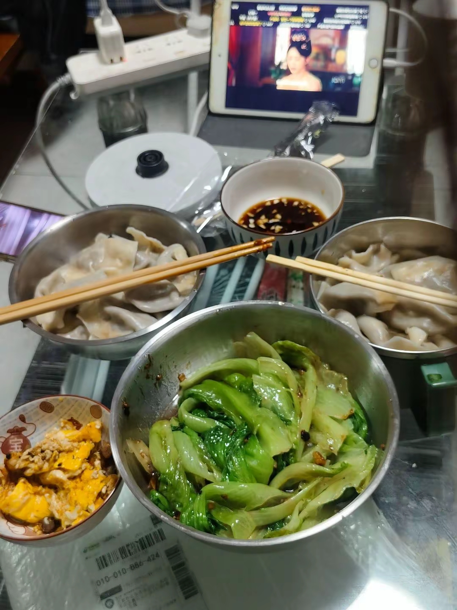

# 一段北京的旧缘分

最近和许久未见的朋友重新碰面，很多尘封已久的回忆一下子就被勾了出来。索性把这些故事记录下来，当作一份留给自己的存档。

最早的时候，是当初合租的那段时光。现在回头去看，那段日子没有什么轰轰烈烈的情节，全是再普通不过的日常。白天我们各自外出忙碌，奔赴自己的事情；等到傍晚回到出租屋，狭小的空间瞬间卸下了白天紧绷的疲惫。

她做的饭菜口味清淡，味道和我姥姥做的很像。2025年8月，对于一个刚来北京实习的小姑娘而言，这份滋味是难得的温暖。

2025年冬天，我从夏县营赶往知春里和她碰面，两个人围在一起包饺子做饭。说不上有什么特别的缘由，可就是一种淡淡的、踏实的幸福感。

2026年春节前，我从理想离职，正准备回家过年。我们相约来到五道口，吃了一顿热气腾腾的火锅，席间定下了后会有期的约定。

再一转眼就到了2026年8月30日，二位“领导”终于在北京荟聚成功会晤。
那天我站在电梯口张望了很久，一直没有看见她的身影。正打算转头望向商场里面，就在回头的一瞬间，远远看见有个人朝着我这边走来。视线再往上抬，一张无比熟悉的面孔映入眼帘。

这时的她已经顺利转正，一名来自山东的小女孩，终于在北京慢慢安定了下来。

人和人的缘分真的很奇妙。最开始我们仅仅只是合租室友，一起度过无数个平平无奇的夜晚，蹭了一口又一口家常便饭。

偌大北京城，人潮来去匆匆，一路上我们会和无数人擦肩而过。可回头再看，真正留下来的人，其实寥寥无几。

祝我们淡淡的，顺顺的~

写下这篇文字，并不是想要刻意渲染一段多么感人的故事。只是随着时间流逝，很多细碎的感受会慢慢淡化。
这件事值得我记住，很多年以后，也值得我再回头慢慢回忆。
它值得！
